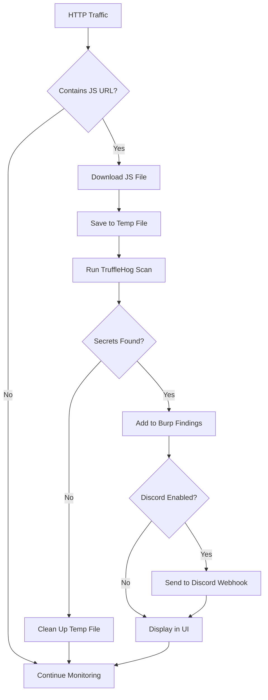

# JSHunter Burp Suite Extension


A powerful Burp Suite extension that automatically detects JavaScript URLs from HTTP traffic, scans them using TruffleHog for secrets detection, and sends findings to Discord webhooks in real-time.

## Features

- **Automatic JavaScript URL Detection**: Monitors HTTP traffic and automatically identifies JavaScript files
- **TruffleHog Integration**: Scans JavaScript files for secrets using the powerful TruffleHog tool
- **Discord Webhook Support**: Sends findings directly to Discord channels for real-time notifications
- **Live Results Display**: Shows scan results and findings in a clean, organized interface
- **Configurable Settings**: Customize TruffleHog path, Discord webhook, and scanning behavior
- **Verified vs Unverified Secrets**: Distinguishes between verified and unverified findings
- **Persistent Settings**: Settings are saved across Burp Suite sessions
- **Adjustable UI**: Resizable panels for better workflow
- **File Browser**: Easy TruffleHog binary path selection
- **Automatic Cleanup**: Temporary files are automatically cleaned up after scanning

## Workflow


### Process Flow
1. **Burp Suite** monitors HTTP traffic and detects JavaScript URLs
2. **TruffleHog** scans the JavaScript files for secrets and vulnerabilities
3. **Discord** receives real-time alerts about discovered secrets

### Detailed Workflow



## Prerequisites

- **Burp Suite**: Professional or Community Edition
- **Python**: Python 2.7 (comes with Burp Suite's Jython)
- **TruffleHog**: TruffleHog binary installed and accessible

## TruffleHog Installation

### macOS
```bash
brew install trufflehog
```

### Linux
```bash
# Download the latest release
curl -L https://github.com/trufflesecurity/trufflehog/releases/latest/download/trufflehog_3.63.7_linux_amd64.tar.gz | tar -xz
sudo mv trufflehog /usr/local/bin/
```

### Windows
```bash
# Using Chocolatey
choco install trufflehog

# Or download from GitHub releases
```

## Installation

### Option 1: Direct Installation (Recommended)

1. **Download the Extension**: Get `jshunter_extension.py` from this repository
2. **Open Burp Suite**: Launch Burp Suite Professional or Community
3. **Go to Extensions**: Navigate to **Extensions** → **Extensions**
4. **Add Extension**: Click **Add** → **Extension type: Python**
5. **Select File**: Choose `jshunter_extension.py`
6. **Install**: Click **Next** and the extension will be loaded

### Option 2: From Source

1. **Clone the repository:**
   ```bash
   git clone https://github.com/iamunixtz/jshunter-burp.git
   cd jshunter-burp
   ```

2. **Install in Burp Suite:**
   - Open Burp Suite
   - Go to **Extensions** → **Extensions**
   - Click **Add** → **Extension type: Python**
   - Select `jshunter_extension.py`

## Configuration

1. **Open JSHunter Tab**: Navigate to the JSHunter tab in Burp Suite
2. **Configure TruffleHog Path**: Set the path to your TruffleHog binary (default: `/usr/local/bin/trufflehog`)
3. **Set Discord Webhook**: Add your Discord webhook URL for notifications
4. **Enable Features**: Toggle auto-scanning and Discord notifications as needed
5. **Test Configuration**: Use the "Test TruffleHog" and "Test Discord" buttons to verify setup

## Usage

1. **Start Monitoring**: The extension automatically monitors HTTP traffic when enabled
2. **View Results**: Scan results appear in the JSHunter interface
3. **Review Findings**: Click on findings to see details including secret type, line number, and verification status
4. **Discord Notifications**: Verified and unverified secrets are sent to Discord with different formatting

## Settings

| Setting | Description | Default |
|---------|-------------|---------|
| TruffleHog Path | Path to TruffleHog executable | `/usr/local/bin/trufflehog` |
| Discord Webhook URL | Discord webhook for notifications | Empty |
| Auto-scan JavaScript URLs | Automatically scan detected JS files | Enabled |
| Send Findings to Discord | Send findings to Discord webhook | Enabled |

## UI Features

### Main Interface
- **Scan Results Panel**: Shows all scanned JavaScript URLs with status
- **Findings Details Panel**: Displays detailed information about detected secrets
- **Resizable Panels**: Adjust panel sizes for better workflow

### Settings Panel
- **TruffleHog Path**: Text field with browse button for easy path selection
- **Discord Webhook URL**: Input field for Discord webhook configuration
- **Auto-scan Toggle**: Enable/disable automatic JavaScript URL scanning
- **Discord Notifications Toggle**: Enable/disable Discord webhook notifications
- **Test Buttons**: Test TruffleHog and Discord webhook configurations

### Findings Table
- **Type**: Type of secret detected (API Key, Token, etc.)
- **Secret**: The actual secret value (redacted for security)
- **URL**: Source JavaScript URL
- **Line**: Line number where the secret was found
- **Verified**: Whether TruffleHog verified the secret
- **Copy Secret**: Button to copy the secret to clipboard
- **Clear Findings**: Button to clear all findings

## Discord Integration

The extension sends formatted messages to Discord when secrets are found:

### Verified Secrets
```
**[VERIFIED] Verified Secrets** found in https://example.com/script.js

**GitHub Token**
```
ghp_***REDACTED***
```
Line: 42
```

### Unverified Secrets
```
**[UNVERIFIED] Unverified Secrets** found in https://example.com/script.js

**API Key**
```
api_key: "***REDACTED***"
```
Line: 15
```

## Troubleshooting

### TruffleHog Not Found
- Verify TruffleHog is installed: `trufflehog --version`
- Check the path in extension settings
- Use the "Test TruffleHog" button to verify

### Discord Webhook Not Working
- Verify the webhook URL is correct
- Test with the "Test Discord" button
- Check Discord server permissions

### No JavaScript URLs Detected
- Ensure you're browsing websites with JavaScript files
- Check that auto-scanning is enabled in settings
- Look for `.js` files in HTTP traffic

### Extension Not Loading
- Ensure you're using Python extension type in Burp Suite
- Check that the file path is correct
- Verify Burp Suite has permission to read the file

## Development

### Prerequisites
- Burp Suite Professional or Community
- Python 2.7 (Jython)
- TruffleHog binary

### Project Structure
```
jshunter-burp/
├── jshunter_extension.py    # Main extension file
├── README.md               # This file
└── LICENSE                 # MIT License
```

### Key Components
- **IBurpExtender**: Main extension interface
- **IHttpListener**: HTTP traffic monitoring
- **ITab**: Custom UI tab
- **TruffleHog Integration**: External binary execution
- **Discord Webhook**: HTTP POST requests
- **Java Swing UI**: User interface components

## Contributing

1. Fork the repository
2. Create a feature branch: `git checkout -b feature/amazing-feature`
3. Commit your changes: `git commit -m 'Add amazing feature'`
4. Push to the branch: `git push origin feature/amazing-feature`
5. Open a Pull Request

## License

This project is licensed under the MIT License - see the [LICENSE](LICENSE) file for details.

## Support

- **Issues**: [GitHub Issues](https://github.com/iamunixtz/jshunter-burp/issues)
- **Discussions**: [GitHub Discussions](https://github.com/iamunixtz/jshunter-burp/discussions)
- **Burp Suite**: [PortSwigger Documentation](https://portswigger.net/burp/documentation)

## Acknowledgments

- [PortSwigger](https://portswigger.net/) for the amazing Burp Suite platform
- [TruffleHog](https://github.com/trufflesecurity/trufflehog) for the powerful secrets scanner
- [Burp Suite Community](https://github.com/portswigger/burp-suite-community-solutions) for extension development resources

## Changelog

### Version 1.0.0
- Initial release
- Automatic JavaScript URL detection
- TruffleHog integration
- Discord webhook support
- Resizable UI panels
- Persistent settings
- Automatic file cleanup
- Comprehensive error handling
